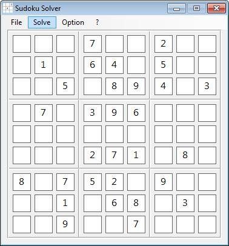

# Sudoku solver program

This program solves all sudoku-puzzles in a very short time (less then 1 second).

You have to insert numbers from a sudoku puzzle to the field.
If you want to delete a number press the space-button on the keyboard.
When you had insert all values from the sudoku puzzle press the "Solve" menu button.

The calculation was made by multiple calculations in rows, columns and carrees.
If there was not a complete result for the whole field, then the calculation 
was done by brute force mechanismen of precalculated result values.

You can also save a sudoku puzzle (input values) to an XML-File and open a saved puzzle.

Content of Sudoku.zip is a Windows Msi-File (Installation-file)
 
[Sudoku.zip](https://github.com/harborsiem/Sudoku/files/1313438/Sudoku.zip)

## For programmers only:

This application was build in C# with Visual Studio 2017.
The installation file was build with the Wix Toolset 3.11

If you want to build the application, then you have to delete assembly signing in the file "sudoku.csproj" (line 14, 15).
